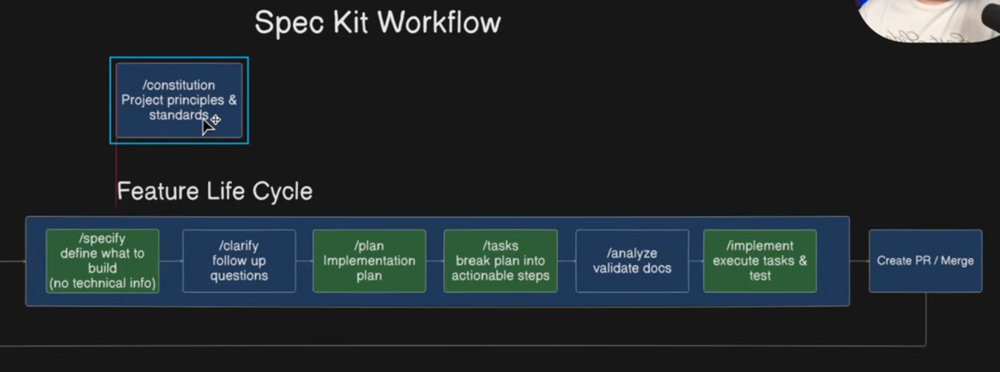

# spec-kit

We have an awesome idea for an app, so we write the prompt, throw it at our coding agent,
and you're like, "All right, let's go." And then you get the results back, and
they're not quite right. Features are missing. There are bugs everywhere. The
UX is kind of terrible. And the agent even added stuff you did not ask for. So
here's the thing. Coding agents are incredibly powerful, but they need structure. They need
the same kind of details that real developers use like edge cases, user stories, architectural
decisions, that kind of stuff. And that's exactly where `spec-kit` comes in the picture.

It's this structured workflow from `github` that gives your agent all the context it needs
to build stable and production-ready applications. We'll learn how to use `spec-kit` with
any `coding-agent` whether that's `claude code` `cursor` `windsurf` `codex` or whatever
you use and we'll follow proper development practices too like using git for `version control`
`branching`, `testing` and lot more.

# What is Speckit and spec-driven development

In short, it's a `workflow` that executes `scripts` and very fine-tuned `prompts` to
produce high quality context for you `coding-agent` and we will go through each of the
steps in detail. It basically introduces or re-introduce `spec driven development` into
your workflow. `spec driven development` has been around for ages. It's basically how
real software development teams figure out what they need to build. So they'll go through
an analysis phase. So they'll `plan` out the changes, break everything up into individual
`tasks`, maybe even split up the work between multiple `developers`, and finally go and
`implement` and `test` those changes. And now we're finally seeing this proven methodology
being used by `coding-agents` as well. And since everything is `documented` and
`planned up front`, the agent knows exactly what it needs todo. In fact if you start a
new conversation, the agent can simply pick up from where it left off. Let's have a
look at all the core components of this `workflow`.

# Core workflow components overview



- /constitution (project principles and standards):

  This is usually setup at the very start of your project and this is where you
  set all the project `principles` and `standards`. Usually, we'll only set this
  up `once` at the start of the project. And we'll only touch this if we ever
  want to add something to the tech-stack or change the agents behavior.

Then for the `main` workflow we have something called the `Feature life cycle`.
This is where we'll run all the `actions` needed to `plan` and `implement` our
actual feature. And the first action is `specify`.

- /specify (define what to build) non-technical info:

  This is where we tell the `agent` what we would like to build. This step `excludes`
  any `technical information`. It's purely the `business` requirements for this
  `feature`.

- /clarify (follow up questions):

  After that, we have an `optional` action called `clarify`. This is where the `agent`
  can look at our `requirements` and ask any follow-up `question`. Now what we have
  `requirements` done, we can go into the `planning phase`.

- /plan (implementation plan):

  Now, the `planning phase` is really cool. This will create a `plan`, the `data-models`
  the service interfaces and even perform research.

- /tasks (break plan into actionable steps):

  Then once we have an `implementation plan`, the next step is to take the `plan` and
  break it up into individual `tasks`. These are all the individual `tasks` like the
  actual code changes to implement this `feature`.

- /analyze (validate docs):

  Then we have another `optional` step called `analyze`. This will simply look at
  everything that's been produced before it to make sure that the `documentation`
  is complete and we've covered everything.

- /implement (execute tasks & tests):

  Then finally, we have the `implement` step. This is where we tell the `coding-agent`
  hey we have everything we need. So go ahead and `implement` all of these `tasks` and
  after that, we should be able to test our changes in the system and ask the agent
  to make any fixes or any adjustments. But once we're happy, we can go ahead and
  create a `pull request` and merge our changes into the `main` branch.

  And if we ever wanted to add a new feature, we can simply start this entire process
  again. And this will create separate specs, separate plans, etc.

# ⚡ Get Started

## 1. Install Specify CLI

Install once and use everywhere:

```bash
uv tool install specify-cli --from git+https://github.com/github/spec-kit.git
```

Then use the tool directly:

```bash
specify init <PROJECT_NAME>
specify check
```

To upgrade Specify, see the Upgrade Guide for detailed instructions. Quick upgrade:

```bash
uv tool install specify-cli --force --from git+https://github.com/github/spec-kit.git

```

# Folder details

- `.specify`:
  After initializing `spec-kit` inside our project, now we have this `.specify` folder
  and we can see changes to the `.cursor` folder because when initializing `spec-kit`
  we selected `cursor` as our `coding-agent`.

- `.specify/memory`:

  When we `expand this specify` folder. we get the `memory` folder which contains the
  `constitution`. By default it contains a blank template containing all the main
  sections for this `constitution` file. So we'll run a command that will actually
  generate the `constitution` and then populate that file with all of our
  `project principles` and `standards`.

- `.specify/scripts`:

  Then we also have the `scripts` folder and they contain all the helper `scripts` that
  the `agent` will use to setup certain things in our project and these `scripts` are
  actually `fascinating`. Then `agent` will use these to do things like creating new
  `branches` and anything else it needs during this `workflow`.

- `.specify/templates`

  Then we also have the `templates` folder and the agent will `reference` these `templates`
  when creating the `spec`, the `plan` and the `task` files for our feature. Depending on
  which `agent` you setup, for you it might just be `claude` maybe just `codex`, just
  `cursor`.
